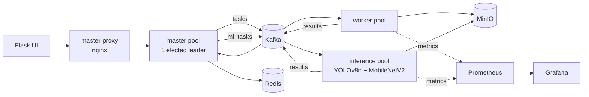
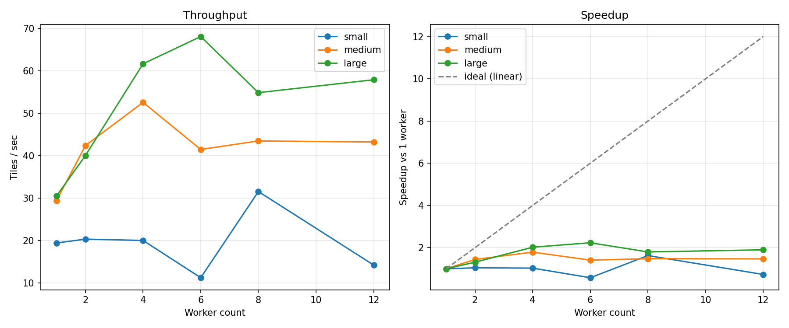

# DIP — Distributed Image Processing

A distributed image-processing pipeline built on Kafka, Redis, and MinIO. A master
node tiles an uploaded image and dispatches the tiles as tasks; a horizontally
scalable worker pool consumes them, applies an OpenCV operation (or, on a separate
pipeline, a two-stage YOLOv8 + MobileNetV2 detection/classification pass), and
publishes results back for reconstruction. Prometheus + Grafana give live metrics;
a reaper gives real fault tolerance.

This is a rebuild of an earlier coursework version. The original had four specific,
fixable architectural defects — a hardcoded 2-worker parallelism ceiling, two
identical files standing in for "two nodes," full image bytes traveling through
Kafka and Redis, and an O(n²) result-aggregation race. **`docs/ARCHITECTURE.md`**
covers what each one was, what fixing it actually bought (measured, not assumed),
and — the more interesting part — where the system still doesn't scale.

## Quickstart

```bash
git clone <this repo>
cd DIP
python scripts/download_model.py   # pulls the ONNX models (gitignored, ~27MB)
docker compose up -d --scale worker=4
```

Then:
- Upload UI: http://localhost:5000
- Grafana (dashboard auto-provisioned, no login needed): http://localhost:3000
- Prometheus: http://localhost:9090
- MinIO console: http://localhost:9001 (`dipadmin` / `dipadmin123` by default)

Scale the worker pool live: `docker compose up -d --scale worker=8`. Kill one mid-job
to see the reaper recover it: `docker kill dip-worker-2`.

Master itself is horizontally scalable too, active-passive with real automatic
failover (~2s, Redis-backed leader election - not just a restart policy): `docker
compose up -d --scale master=3`, then kill whichever replica `docker exec <name>
curl localhost:5000/health` reports as leader and watch a new one take over. See
`docs/ARCHITECTURE.md`'s "Master, upgraded to active-passive" section for how.

## Architecture



Full diagram, the four original defects, and an honest "where this still doesn't
scale" section: **[docs/ARCHITECTURE.md](docs/ARCHITECTURE.md)**.

## The number that matters

Fixing the hardcoded 2-worker ceiling (Step 3) made scaling *possible*; the claim-check
pattern (Step 5) and atomic Redis hashes (Step 6) removed two ceilings that made it
*flat*; a threaded MinIO-publish loop and pinning each container to one OpenCV thread
(found via an independent audit, not assumed) removed a third:



**30.5 → 68.1 tiles/s (2.2x) at 6 workers**, large image (144 tiles) — and critically,
the *shape* of the curve is right: rising throughput with rising latency from genuine
queueing, not the flat-throughput/rising-latency signature of contention that showed
up (and got fixed) twice earlier in this project, once for the OpenCV pipeline and
once for the ML inference pipeline's replica scaling (`docs/ARCHITECTURE.md` covers
both). Honest caveat on this particular run: throughput dips at 8 workers before
recovering at 12 — this sweep happened to run while another heavy Docker workload was
also active on the same host, so treat 6-12 workers as "still clearly scaled up from
1," not as a precise ranking of 6 vs. 8 vs. 12. A cleaner, quieter 1-vs-8 spot check
(`bench/results/post_fix_check.csv`) showed the same fix produce a smooth
31.6 → 52.9 tiles/s.

Regenerate this chart, or re-run any of the other benchmark sweeps
(`bench/run_inference_batch_sweep.py`, `bench/run_inference_replica_sweep.py`):

```bash
source .venv/bin/activate && pip install -r requirements.txt
python -m bench.run_bench --output bench/results/final.csv
python -m bench.plot --input bench/results/final.csv --output bench/results/final_speedup.png
```

## Tests

```bash
pip install -r requirements-test.txt
pytest tests/ -v
```

Unit tests for tiling/reconstruction (`app/imaging.py`) and the 13 OpenCV operations
(`app/ops.py`); an integration test for `app/jobstore.py`'s Redis state against a real
Redis (via `testcontainers`) — specifically the idempotent duplicate-result handling
that a live kill-a-worker demo actually triggered once, for real, during Step 7.

## Repo layout

| Path | Role |
|---|---|
| `app/` | Shared: config, tiling/codec, ops, Redis job state, Kafka config, Prometheus metrics, leader election |
| `master/` | Flask routes, task publishing, result consumption, heartbeat tracking, the reaper — all horizontally scalable, `docker compose up --scale master=N` |
| `worker/` | The single worker entrypoint — `docker compose up --scale worker=N` |
| `inference/` | ML inference entrypoint — separate consumer group, dynamic batching |
| `bench/` | Benchmark harness + plotting, runs on the host |
| `tests/` | pytest suite |
| `monitoring/` | Prometheus scrape config, Grafana dashboard/datasource provisioning, the master-proxy nginx config |
| `docs/` | Architecture writeup |

## Repo conventions

- `uploads/`, `results/`, and `models/*.onnx` are runtime artifacts and are
  **git-ignored** — don't commit images or model weights.
- Configuration comes from environment variables (see `.env.example` and
  `docker-compose.yml`), never hardcoded.
