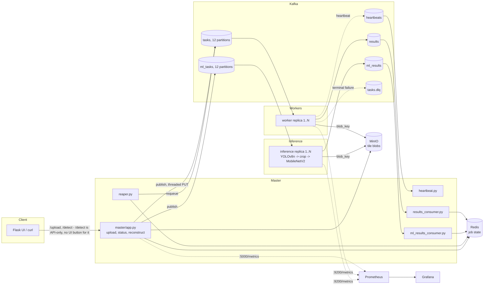

# Architecture

This document explains why the system looks the way it does: the four defects that
drove the rebuild, what each fix actually bought (measured, not assumed), and — the
part worth reading closely — where the system still doesn't scale.

## System overview

Two independent pipelines share the master and infrastructure but never compete for
partitions: the OpenCV filter pipeline (`tasks`/`results`, consumer group
`image-processing-workers`) and the ML detection pipeline (`ml_tasks`/`ml_results`,
consumer group `ml-inference-workers`). Both use the same claim-check pattern (MinIO
for bytes, Kafka for pointers) and the same Redis job-state schema — `app/jobstore.py`
was never OpenCV-specific, it just stores whatever dict a tile produces.

## The four original defects, and what fixing them actually bought

The original codebase (`worker1.py`, `worker2.py`, `master.py`, a single 1855-line
file) had four defects that mattered more than any missing feature, because each one
is a real, specific, fixable flaw rather than a vague "could be better."

### 1. Parallelism was hard-capped at 2 workers

`tasks` was created with `--partitions 2`, and both sides hardcoded
`partition = tile_id % 2`. Kafka assigns whole *partitions* to consumers in a group,
not individual messages — so a third worker sat idle forever no matter how many were
started, and no speedup measurement above 2x was even possible.

**Fix**: `tasks`/`ml_tasks` now have 12 partitions each; publishing uses
`key=f"{job_id}:{tile_id}"` with no explicit partition, letting Kafka's default hash
partitioner spread work. Verified via
`kafka-consumer-groups.sh --describe --group image-processing-workers` showing all 12
partitions distributed evenly across N running workers.

**What it bought**: the *precondition* for every other scaling number in this
document. Without this, none of the throughput numbers below mean anything — you
can't measure a speedup curve on a system that structurally caps out at 2 workers.

### 2. Two files standing in for two nodes

`worker1.py` and `worker2.py` were byte-identical apart from whitespace (`diff -qwB`
confirmed it). Scaling meant copy-pasting a file, not running more instances of one.

**Fix**: collapsed into `worker/main.py`, identity from a `WORKER_ID` env var that
falls back to `worker-{hostname}` — each `docker compose up --scale worker=N` replica
auto-differentiates with zero per-replica config.

**What it bought**: `docker compose up --scale worker=8` is now a real sentence,
not a manual multi-file edit. This is also what made the DNS-service-discovery
approach to Prometheus scraping (Step 8) possible at all — Compose's embedded DNS
resolves the `worker` service name to one A record per running replica.

### 3. Full image bytes traveled through Kafka *and* landed in Redis

`encode_image()` base64'd each tile into the Kafka task payload (+33% over raw JPEG),
which forced `message.max.bytes` up to 50MB as a band-aid. Results were then stored
base64 in Redis too.

**Fix (claim-check pattern, Step 5)**: `app/blobstore.py` puts tile bytes in MinIO;
Kafka carries only `{job_id, tile_id, blob_key, x, y, width, height, ...}` — about
200 bytes instead of ~700KB. `message.max.bytes` dropped back to Kafka's 1MB default.

**What it bought, measured** (large image, 144 tiles): `avg_tile_kb` dropped from
~155KB/tile to **0.23KB/tile** (~670x). Throughput also improved for the first time
since Step 3 — flat ~21-23 tiles/s baseline rose to **28.8 tiles/s at 1 worker,
~33 tiles/s by 6-8 workers**. But it still plateaued well short of linear scaling —
this pointed straight at defect #4.

### 4. Result aggregation was O(n²) and racy

`listen_for_results()` GETed the *entire* `job:{id}:tiles` JSON blob for every single
tile, mutated it in Python, and SETEX'd the whole thing back — O(n) work per tile,
O(n²) over a job, and a read-modify-write race the moment two processes touch the
same job.

**Fix (Step 6)**: `job:{id}` and `job:{id}:tiles` became Redis hashes, updated via
single-field `HINCRBY`/`HSET` calls — O(1) per tile, no snapshot rewrite.
`job:{id}:latencies` became a list, `RPUSH`ed per tile. Also fixed in the same pass:
`job_id[:8]` truncation (50% collision odds around 77k jobs) — Redis keys and MinIO
paths now always use the full UUID.

**What it bought, measured**: large-image throughput at **1 worker** jumped to
**33.68 tiles/s** — already at the level claim-check alone needed 6-8 workers to
reach. But scaling across worker counts went completely *flat* (33.68 → 31.31 tiles/s
across 1→12 workers) — a new, different ceiling had just become visible.

### The bonus finding this predicted: master's own publish loop

An independent, context-blind audit (a fresh subagent given only the code and numbers,
no hint of a hypothesis) confirmed the flat-across-workers result was caused by
`master/publisher.py` PUTting every tile to MinIO serially, one HTTP round-trip at a
time, on the Flask request thread — for a 144-tile job that's 144 sequential
round-trips no worker pool size can shrink (a textbook Amdahl's Law ceiling). It also
found a second, independent bug: nothing called `cv2.setNumThreads()`, so every
container ran OpenCV across the full host core count internally — at 12 workers that's
~192 OpenCV threads contending for 16 real cores.

**Fix**: MinIO PUTs now run across a `ThreadPoolExecutor` (pure I/O wait, safe to
parallelize); `cv2.setNumThreads(1)` pins each container to scale via more containers,
not more internal threads.

**Result**: a quiet 1-vs-8-worker spot check (`bench/results/post_fix_check.csv`)
showed **31.62 → 52.85 tiles/s (1.67x)**; a fuller sweep across 1/2/4/6/8/12 workers
(`bench/results/final.csv`, `bench/results/final_speedup.png` — the README's headline
chart) showed the same fix produce **30.5 → 68.1 tiles/s (2.2x) peaking at 6 workers**,
with a dip at 8 that recovers by 12 - almost certainly host contention from another
heavy Docker workload running at the same time as that particular sweep, not a
property of the fix itself (the quiet spot check is the cleaner signal). Either way,
the latency signature flipped from "flat throughput + rising latency" (contention —
the wrong shape) to "rising throughput + rising latency from genuine queueing" (the
correct shape for a worker-bound system).

## Fault tolerance (Step 7)

At-least-once delivery, a dead-letter queue, and tile-level retry/reassignment
(`master/reaper.py`), demoed live: killed a worker mid-job (64 tiles, 3 workers), the
job stalled at 58/64, the reaper detected 6 outstanding tiles after ~22s and requeued
them, the job completed correctly at t=35.8s.

The live demo organically reproduced a real race, not a hypothetical one: Kafka's own
consumer-group rebalance redelivered some of the dead worker's uncommitted tiles at
nearly the same moment the reaper independently requeued them. Under the pre-fix
counting logic (`HINCRBY` on every result, duplicates included) this would have
inflated `results_count` past the true distinct-tile count and flipped the job to
"ready" while a tile was still genuinely missing. Fixed by switching the completion
signal to `HSET`'s return value (was this tile new?) gating the increment, with `HLEN`
(the true distinct count) as the source of truth instead of a counter that assumes no
redelivery.

### Post-Step-7 addendum: closing two gaps that were left as documented future work

Two items sat in this document's "still doesn't scale" section for a while, then got
fixed directly:

**ML job recovery.** The reaper originally only knew the OpenCV pipeline's blob-key
convention (`{job_id}/task/{tile_id}.jpg` on `tasks`) and, after being caught wrongly
marking every in-flight ML job `degraded`, was fixed to simply *skip*
`operation == 'object_detection'` jobs rather than mishandle them - a real fix for a
real bug, but it left genuinely stuck ML jobs with no recovery path at all.
`_republish_tile()` now branches on the job's operation and uses the correct
convention for each pipeline (`{job_id}/ml_task/{tile_id}.jpg` on `ml_tasks` for ML).
Verified live, the same way Step 7's OpenCV demo was: uploaded a 64-tile `/detect`
job, killed the inference container, and — critically, unlike a first attempt at
this test where the still-running inference container simply finished the job before
the kill could land — confirmed via `docker ps` that inference was dead *before*
uploading, then waited out the full `TILE_OUTSTANDING_TIMEOUT_SECONDS` window with it
still down. The reaper logged `64 tile(s) outstanding after 24s` and requeued all 64
through the ML topic/blob convention; restarting inference completed the job
(64/64). This is why Kafka's own redelivery isn't sufficient on its own even though
it handles many cases automatically: it only redelivers to a *live* group member,
with no time bound and no concept of giving up - the reaper adds an
application-owned SLA (`TILE_OUTSTANDING_TIMEOUT_SECONDS`), a bounded retry count
(`MAX_TILE_ATTEMPTS`), and a terminal `degraded` state, none of which Kafka's
consumer-group protocol has any notion of.

**Live DLQ depth.** `dip_dlq_total` only ever grows and is scoped to whichever
worker process incremented it - it can't answer "how many tiles are on the DLQ right
now." Added `master/dlq_monitor.py`: a background thread that polls
`tasks.dlq`'s real Kafka watermarks (`high - low`, summed across partitions) every
5s via `Consumer.get_watermark_offsets()` and sets a `dip_dlq_depth` gauge -
standalone, not a consumer, so it doesn't join the DLQ's consumer group or interfere
with any future DLQ-draining tool. Verified against real state, not a synthetic
zero: after rebuilding and restarting master, `/metrics` immediately reported
`dip_dlq_depth 3` - the three tiles a DLQ test earlier in this same session had
actually left sitting on the topic, which a fresh in-process counter would have had
no way to know about.

### Master failure recovery, and a real Docker gotcha found while testing it

Master holds no job state of its own since Step 6 - Redis and Kafka own it - so the
theory was that killing and restarting master shouldn't lose anything. Tested
directly, not assumed: uploaded a 144-tile OpenCV job, killed `dip-master`
mid-flight (workers keep consuming `tasks` and publishing to `results`
independently of whether master is alive - only master's own consumer threads stop),
waited while results piled up uncommitted in Kafka, brought a fresh master
container up, and confirmed `144/144` tiles received with zero loss, followed by a
real, correct reconstruction (not just a matching count).

While hardening this further - adding `restart: unless-stopped` to every
long-running service, so a *real* crash (not a demo kill) doesn't need a human to
notice and run `docker compose up` - a genuine Docker semantic surfaced that's worth
documenting because it contradicts the intuitive assumption: **`docker kill` (and
`docker stop`) explicitly disable a container's restart policy until it's manually
started again**, confirmed even for `restart: always`, via isolated `docker run`
tests outside this project entirely. Docker treats any operator-issued kill/stop as
intentional and will not auto-restart the container for it - only a genuine
unexpected exit (verified separately: a plain `exit 1` inside a throwaway container
auto-restarted twice within 6 seconds) triggers the policy.

This means this project now has two real, complementary recovery layers, and it
matters to be precise about which one covers which failure mode: the **reaper +
idempotent result handling** (Step 7) is what recovers from every `docker kill`-based
demo in this document, including the master-kill test above - pure
application-level recovery via externalized Kafka/Redis state, with no help from
Docker. **`restart: unless-stopped`** is a separate safety net for failure modes the
kill-based demos never exercise at all - OOM kills, unhandled exceptions, segfaults -
where the container process dies on its own rather than being told to stop by an
operator.

### Master, upgraded from single-instance to active-passive with real automatic failover

The section above proved master *can* recover from a kill with zero data loss - but
recovery required a human to notice and run `docker compose up`. Asked directly
which HA pattern made sense here, active-active or active-passive, even with
unlimited engineering time: **active-passive**, and not for a "not worth the
effort" reason. Master's remaining duties past HTTP routing - the reaper's sweep,
result consumption - are inherently *singleton* work: coordination over one shared
state space (every in-flight job), not independently-partitionable work the way
tiles are. Running them on every replica at once wouldn't scale anything (Kafka and
Redis are the real scale points already); it would just create races over who gets
to increment a tile's retry counter, solvable only by adding leader
election/duty-partitioning anyway - at which point you've built active-passive with
extra steps, not genuine active-active.

So: built real active-passive, with automatic sub-few-second failover instead of a
human running a command.

- **`master` is now horizontally scalable** (`docker compose up --scale master=N`) -
  removed the fixed `container_name` and hardcoded `INSTANCE_ID: master-1` (now
  falls back to hostname, same pattern `WORKER_ID` already used).
- **HTTP routes need no coordination at all** - `/upload`, `/status`, `/reconstruct`
  etc. only ever read/write Redis, Kafka, and MinIO, never in-process state, so
  *every* replica can safely answer *any* request simultaneously. `master-proxy`
  (nginx) round-robins host port 5000 across all replicas via Docker's embedded DNS
  - the same `dns_sd_configs` mechanism already used for scraping `worker`/
  `inference`, applied here to routing instead of monitoring. Prometheus's own
  scrape config for `dip-master` had to switch from a static target to
  `dns_sd_configs` too for the same reason - a static hostname target only ever
  resolves to one arbitrary replica, silently missing the others.
- **Real leader election for the singleton duties** (`app/leader.py`): a Redis lock
  (`SET NX PX 2000`, renewed every 500ms via a compare-and-extend Lua script so a
  slow renewal can't steal back a lock another process has since acquired) - not a
  multi-node Redlock consensus, since Redis itself isn't being made highly
  available here, it's already a single point of failure for job state and this
  doesn't change that. `master/reaper.py` and both result consumers
  (`master/results_consumer.py`, `master/ml_results_consumer.py`) now check
  `is_leader()` before doing any work; the result consumers additionally moved from
  a per-instance Kafka consumer group to one **shared** group name - critical for
  correctness, not just tidiness: a per-instance group would mean a newly-elected
  leader starts with zero committed offsets and replays the *entire* results topic
  from scratch on every failover (`auto.offset.reset: earliest`), instead of
  continuing from exactly where the previous leader's last commit left off.
- **Heartbeat tracking moved to Redis** (`heartbeat:{worker_id}` keys with a TTL,
  replacing the in-process dict `master/heartbeat.py` used before) - this closes
  the actual root cause of the 503-after-restart gap the master-failure-recovery
  test above exposed. Every replica runs its own heartbeat consumer unconditionally
  (not leader-gated - it's not a singleton duty, every replica should have its own
  live view), and Redis's own key expiry *is* the dead-worker check now, replacing
  a manual timestamp-comparison-then-delete loop that could race with a concurrent
  update.

**Verified live, not just by design**: scaled to 3 master replicas, confirmed via
`/health` on each that exactly one reported `is_leader: true`; confirmed the nginx
proxy actually round-robins (six requests through `localhost:5000` hit all three
replica IDs) and every replica answers correctly regardless of leadership; `docker
kill`-ed the leader and measured the real failover time from container timestamps,
not a polling loop's own overhead - **2.1 seconds** (`FinishedAt` to the new
leader's "Acquired leadership" log line), right in line with the 2-second lock TTL.
Uploaded a real job through the proxy immediately after killing the old leader and
confirmed it completed correctly (64/64 tiles) on the new one. Brought the old
leader back and confirmed it rejoined as a healthy follower without disputing the
current leader - exactly one `dip_is_leader=1` across all three replicas
afterward, the new Grafana panel's own correctness check.

## ML inference (Step 9) and the two axes of "does it scale"

A two-stage detect→classify pipeline (YOLOv8n → crop → MobileNetV2) behind its own
Kafka consumer group, with dynamic batching (accumulate by size-or-timeout) and real
backpressure (`consumer.pause()`/`resume()` on a queue-depth watermark, not an
unbounded queue that just delays an OOM).

Two genuinely different questions got asked and measured separately here, and
conflating them would have produced a misleading resume claim:

**Does a bigger batch size help one inference container?** The stock Ultralytics
ONNX export has a *hardcoded* batch=1 dimension baked into a `Reshape` node inside the
detection head (not just the declared I/O shape — patching that alone still crashed
mid-graph). A startup probe (`DetectionEngine._probe_batch_support`) detects this and
falls back to per-tile calls when needed, so the accumulate-by-size-or-timeout
*scheduling* benefit (bounded latency, fewer round trips) still holds even when the
actual forward pass can't batch. Re-exporting with `dynamic=True` fixed the underlying
model; re-running the batch-size sweep against it showed only a modest ~5-10%
throughput/latency improvement, because ONNX Runtime's CPU provider already threads a
single image's convolution internally — stacking images into one call mostly saves
call overhead, not FLOPs, on CPU. (This would be expected to matter far more on GPU,
where batching amortizes real per-call kernel-launch overhead across a much
higher-throughput backend.)

**Does adding more inference containers help?** This is the question that actually
justifies putting ML inference behind a scaled consumer group at all, and it was
*not* answered by the batch-size sweep. Tested directly with
`bench/run_inference_replica_sweep.py`: unfixed, `--scale inference=N` made things
strictly *worse* — flat ~7 tiles/s with p99 latency exploding from 134ms to ~2 seconds
at 8 replicas. Root cause: identical to defect #4's `cv2.setNumThreads` bug, just
never applied to `inference/engine.py` — ONNX Runtime's `CPUExecutionProvider`
defaults to using every host core *per session*, and each replica loads two sessions.
Fixed with `INFERENCE_INTRA_OP_THREADS=1`. Re-run: **3.8 → 11.2 tiles/s,
monotonically rising, across 1→8 replicas** — the correct scaling shape. The honest
cost: single-replica throughput *regressed* (7.3 → 3.8 tiles/s) because that one
container no longer secretly oversubscribes all 16 cores for itself. That's a real
tradeoff, not a clean win — and a better interview answer than a suspiciously perfect
curve would be.

## GPU

GPU inference is enabled and working (`INFERENCE_USE_GPU=true`). It wasn't always -
worth telling the real story since the first diagnosis was wrong.

`onnxruntime-gpu` successfully loaded `CUDAExecutionProvider` and ran real inference
on the GPU early on, but under sustained real pipeline load it intermittently hung —
full CPU across dozens of threads, zero forward progress, no exception. The first
theory was a CUDA/cuDNN/cuBLAS version-pairing mismatch (the pip packages had been
hand-assembled one at a time to satisfy error messages), so GPU was disabled and CPU
used instead while that theory sat undisturbed for most of this project.

**The real root cause, found later**: this host's GPU (RTX 5050) is Blackwell,
compute capability sm_120. `onnxruntime-gpu`'s own release build script decides
which GPU architectures get compiled into each wheel
(`CMAKE_CUDA_ARCHITECTURES`), and the pinned version (1.19.2) only compiles up to
compute_80 - there was no sm_120 machine code in that wheel at all. Every CUDA
kernel therefore had to be JIT-compiled by the driver at runtime: CPU-bound,
multi-threaded, throws nothing, and eventually succeeds - exactly the observed
"high CPU, zero progress, no exception, clears on its own" signature. No CUDA/cuDNN
version combination could have fixed this; the JIT stall was reproduced directly
(forcing `CUDA_MODULE_LOADING=EAGER` pegs a core for minutes) to confirm before
committing to a fix.

**Fix**: `onnxruntime-gpu==1.28.0` - the oldest PyPI release built with native
`120-real` cubins (PyPI's package became a CUDA 13 build starting at 1.27). The
CUDA/cuDNN/cuBLAS pins in `requirements-gpu.txt` (split out from the base
`requirements.txt` during a later review - see that file's own comment) are the
exact resolution of onnxruntime-gpu's own declared `[cuda,cudnn]` extras this
time, not hand-assembled. `inference/engine.py` calls `ort.preload_dlls()`
(ONNX Runtime's own supported mechanism) to resolve those libraries out of
their pip package locations; `Dockerfile`'s `LD_LIBRARY_PATH` sets the same
paths as a redundant fallback, not a replacement for it.

**Sustained load test, not a synthetic single call**: 1018 jobs / 16,288 tiles over
380 continuous seconds, zero stalls, zero exceptions, p95 job time 0.93s, GPU
memory pinned at ~2.15GB throughout.

**GPU vs CPU** (`bench/results/inference_batch_sweep_gpu.csv` vs the CPU
equivalent): ~3.7x throughput, ~4.5x lower p50 latency (batch=1: 127.9ms CPU vs.
28.2ms GPU). One finding worth flagging, later fixed (see "Where this still doesn't
scale" below - `INFERENCE_BATCH_TIMEOUT_MS` now defaults hardware-aware): on GPU,
**batch=1 is now the fastest configuration** - the forward pass
itself dropped to ~7ms, so `INFERENCE_BATCH_TIMEOUT_MS` (50ms, tuned during the CPU
era) is now the dominant cost at low load rather than compute. The batching tuning
that made sense for a 120-150ms/tile CPU workload is actively counterproductive for
a ~7ms/tile GPU
one.

**GPU horizontal scaling looks different from CPU's, and it's worth being precise
about why** (`bench/results/inference_replica_sweep_gpu.csv`):

| replicas | CPU tiles/s | GPU tiles/s |
|---|---|---|
| 1 | 3.80 | 31.60 |
| 2 | 6.50 | 36.39 |
| 4 | 9.22 | **45.58** |
| 8 | 11.17 | 2.08 (`degraded`) |

The GPU's per-replica advantage *shrinks* as replica count rises (8.3x → 5.6x →
4.9x at 1/2/4) rather than holding steady like CPU's does, because CPU replicas
each get an independent physical core while GPU replicas all contend for the same
GPU's compute and memory bandwidth. At 8 replicas it falls off a cliff entirely -
each replica holds a ~1.8GB CUDA context, and 8 × 1.8GB exceeds the 8GB card's
VRAM, so jobs start finishing incomplete (`degraded`) rather than completing
slowly. That's a **hard memory wall**, categorically different from CPU's *soft*
thread-contention ceiling (which degrades gracefully, never fails a job). Practical
conclusion: **4 GPU replicas (45.6 tiles/s) is this box's real ceiling**, and it
still beats CPU's own best (8 replicas, 11.2 tiles/s) by roughly 4x.

## Observability (Step 8)

Prometheus + Grafana, provisioned in-repo (no manual dashboard setup after
`docker compose up`). Master exposes `/metrics` as a normal Flask route (it already
runs an HTTP server, unlike worker/inference); worker and inference run
`prometheus_client.start_http_server(9200)` instead. All three are scraped via
`dns_sd_configs`, not static targets - this section originally described master as a
single fixed container with a static scrape target, which stopped being true once
master itself became horizontally scalable (see "Master, upgraded to
active-passive" below) and its own Prometheus job had to switch to DNS-SD too, for
the same reason worker/inference already needed it: `--scale <service>=N` gives
each replica a distinct IP with no static port mapping. Compose's embedded DNS
resolves the service name to one A record per running replica, which Prometheus's
DNS-SD polls directly.

## Where this still doesn't scale (the honest part)
- **Both CPU and GPU have a real ceiling, just different shapes of one.** CPU's
  ~120-150ms/tile is a property of running a detection model on CPU at all - the
  thread-oversubscription fix made that ceiling *horizontally scalable*, not
  *lower*. GPU's ~7ms/tile compute is far cheaper; the batch-accumulation timeout
  mismatch this created was fixed (`INFERENCE_BATCH_TIMEOUT_MS` now defaults
  hardware-aware, see the GPU section above), but GPU replica count still hits a
  hard VRAM wall at 8 replicas on this 8GB card rather than degrading gracefully
  the way CPU thread contention does - that part isn't fixable by tuning, it's the
  card's actual memory limit.
- **`TILE_SIZE`/`MAX_TILES` are still fixed constants, not adaptive to a given
  image** - see the "Tile size" section below for why 256 specifically is no
  longer a guess, just not a per-request decision. A production system might pick
  tile size per-upload based on image dimensions and current worker count rather
  than one global default for every job.
- **Two of the thirteen OpenCV operations are global operations applied
  tile-locally, and the reconstructed output is NOT the same as running them on
  the whole image** - found during a full-project review, not something the
  original tiling design accounted for. `edge_sobel` normalizes each tile by
  its OWN max gradient (`app/ops.py`); `histogram_equalization` equalizes each
  tile's histogram independently. Both mean a reconstructed image has visible
  per-tile brightness/contrast seams at tile boundaries, and differs from
  what the same operation would produce on the undivided image - genuinely
  different output, not a rounding-error-level discrepancy. `tests/test_ops.py`
  only asserts shape/dtype per op, so nothing currently catches this. A real
  fix needs either a second aggregation pass (compute the global max/histogram
  across all tiles before normalizing any of them) or accepting the tradeoff
  and documenting it in the UI, not just here.

## Tile size: from "tuned by inspection" to actually measured

`TILE_SIZE` defaulted to 512 for most of this project - a plausible-looking number,
never tested against alternatives. Measured directly instead of assumed:
`bench/run_tile_size_sweep.py` swept 256/384/512/768/1024 against the same 3
benchmark image sizes `bench/run_bench.py` already uses, holding worker count fixed
at 4 so tile size was the only variable.

| tile_size | small (tiles/s) | medium (tiles/s) | large (tiles/s) |
|---|---|---|---|
| 256 | 40.2 | 131.5 | **143.9** |
| 384 | 42.7 | 81.5 | 79.5 |
| 512 (old default) | 19.0 | 49.4 | 58.1 |
| 768 | 12.2 | 28.4 | 27.9 |
| 1024 | 4.8 | 12.8 | 14.3 |

256 won outright, by a wide margin (~2-2.5x over the old default on every image
size) - smaller tiles mean more of them to spread across the worker pool and less
per-tile OpenCV work, and that outweighs the added per-tile Kafka/MinIO round-trip
overhead at every size actually tested here. `TILE_SIZE`'s default is now 256.

This exposed a real edge case, not just a number to bump: `MAX_TILES` (1000) was
sized against the *old* default's worst case (`8192x8192 / 512` = 256 tiles) with
generous headroom. Dropping the tile size to 256 raises that same worst case to
1024 tiles - just over the old cap - which would have silently turned the largest
previously-valid upload into a rejected one (`Image too large`) as a side effect of
a throughput fix nobody would think to connect to it. Caught and fixed together:
`MAX_TILES` raised to 1200, keeping the same margin-over-worst-case ratio the
original value had. Verified directly, not just by the arithmetic: uploaded a real
8192x8192 image, confirmed it produces exactly 1024 tiles and is accepted, not
rejected.
